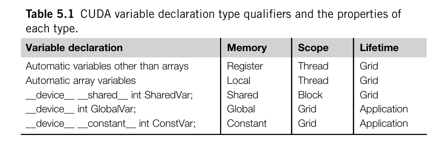

# Day 6

Read Chapter 5.1 and 5.2

The different types of memory allocations:



```cpp
__device__ __shared__ int sharedInt // Used for Shared Memory block
```


```cpp
__device__ int globalInt // global device memory - local to grid
```


```cpp
__device__ __constant__ int constInt // local to grid - constant
```


**Lifetimes**


Lifetime tells the portion of the program’s execution duration when the variable is available for use: either within a grid’s execution or throughout the entire applica
tion.

* If a variable’s lifetime is within a grid’s execution, it must be declared within
  the kernel function body and will be available for use only by the kernel’s code. If the kernel is invoked several times, the value of the variable is not maintained acrossthese invocations. Each invocation must initialize the variable in order to use it.
* On the other hand, if a variable’s lifetime is throughout the entire application, it must be declared outside of any function body. The contents of these variables are maintained throughout the execution of the application and available to all kernels.

**Automatic variables** **that are "arrays"** are not stored in  registers - compiler may choose to do so in cases where all access are done via constant index values.

* For each thread there is a separate array invoked
* One rarely needs automatic array variables

One thing to note about the `__device__` invocation is that it stores stuff in global memory but since there is no way to synchronize tasks across threads in different blocks and also ensure data consistency - it is just used for sharing data on different kernel invocations.
